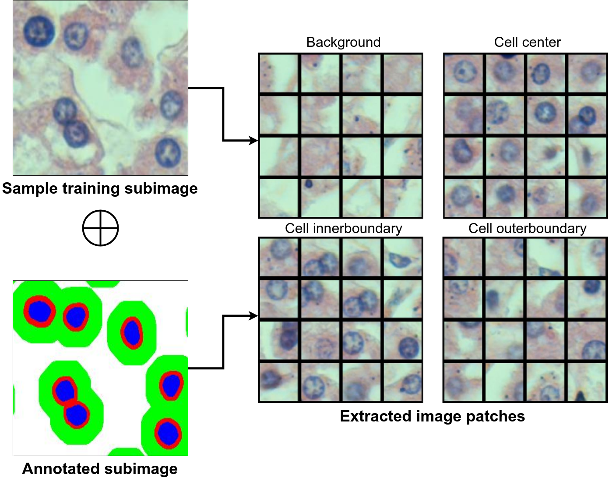
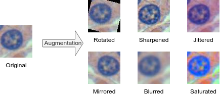
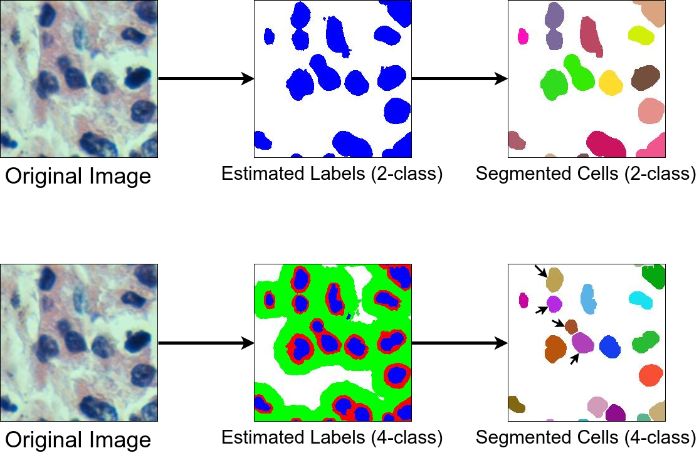

Deep Learning Based Cell Segmentation
===

This is an example cell segmentation procedure in histopathological images based on convolutional neural networks.

Unlike traditional deep learning based approaches which use 2-classes ("background" and "cell"), we use 4-classes ("background", "cell center", "cell innerboundary" and "cell outerboundary") as inputs to train the model. In this way, we can delineate nucleus boundaries more accurately. Following figure demonstrates a training patch extraction procedure for 4-class model.

  

Data Augmentation
-------------
In machine learning, the more data samples we have, the better our model will be. However, we do not have so many data samples in practice since collecting and labeling data are time consuming and costly processes. Therefore, we need data augmentation which is a technique for increasing the number of samples in the dataset in artificial ways. In this project, we augment the number of training images using "mirroring", "random rotation", and "filtering". Sample augmented images are shown in the following figure. 

  

Results
-------------
In the following figure, sample segmentation results are shown for 2-class and 4-class deep learning model. In this figure, each class label is shown with a different color ("background": white, "cell center": blue, "cell innerboundary": red, and "cell outerboundary": green). Here, notice that 4-class model performs better segmentation especially for overlapping cells. 

  

Prerequisites
-------------
[Caffe](http://caffe.berkeleyvision.org/) framework and Matlab is used for the implementation of the project

Matlab, Caffe, Matcaffe

Project is implemented on Ubuntu 16.04 machine with Matlab R2014a installed

Contact
-------
E-mail: deniz.mail@gmail.com

References
------------
- http://caffe.berkeleyvision.org/
